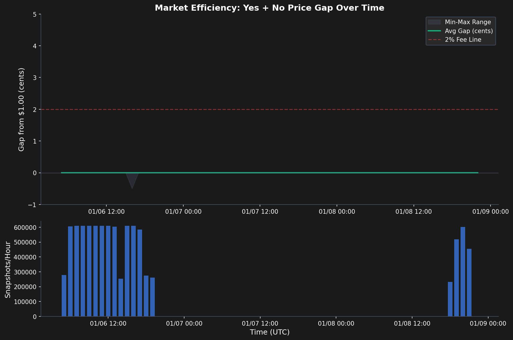
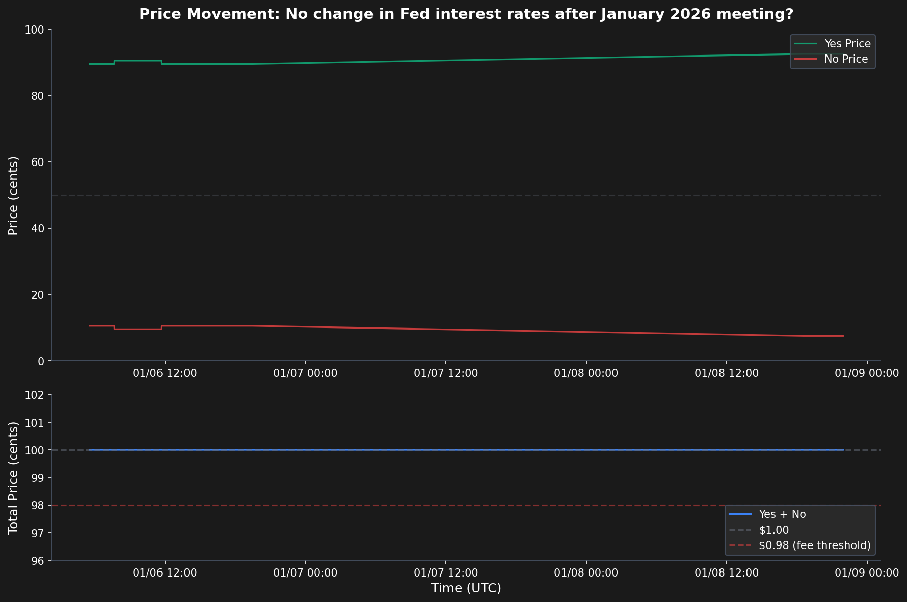

# Can You Arbitrage Polymarket with AI?

*I built a prediction market scanner to find mispricings. Here's what I learned.*

## The Hypothesis

Prediction markets aggregate information through prices. But retail markets like Polymarket should have exploitable inefficiencies—stale prices, overreactions, arbitrage gaps. I built a scanner with Claude Code to find out.

## What I Built

A Node.js scanner that polls Polymarket every 30 seconds, looking for 4 types of signals:

1. **Complement Arbitrage**: Yes + No should cost $1. If not, free money.
2. **Anchoring/Overreaction**: Sharp moves on low volume often revert.
3. **Low Attention**: Boring markets reprice slowly.
4. **Deadline Pressure**: Markets requiring formal acts (legislation, rulings) are often overpriced.

```
Polymarket API → Ingester → SQLite → Signal Engine → API Server → React Dashboard
                   (30s)              (4 signals)
```

## The Data

Over 2.7 days of continuous scanning:

- **9.5 million** market snapshots
- **7,663** signals detected
- **0** complement arbitrage opportunities
- **0** tradeable signals (spread < 5%)



## The Results

| Signal Type | Count | Tradeable (spread <5%) |
|-------------|-------|------------------------|
| Low Attention | 5,080 | 0 (0%) |
| Deadline | 2,583 | 0 (0%) |
| Complement | 0 | - |
| Anchoring | 0 | - |

The market is more efficient than expected. Every single snapshot showed Yes + No prices summing to exactly $1.00 (within rounding).



## Why Arbitrage Failed

1. **Market makers are sophisticated** — Spreads are wide on thin markets, eliminating any edge before you can trade.

2. **Fees eat small edges** — Polymarket's 2% fee kills sub-3-cent arbs.

3. **30-second polling is too slow** — Real arbs get taken in milliseconds.

4. **Even "inefficient" markets are untradeable** — Low attention signals exist, but the spreads make them worthless.

## What I Learned

Prediction markets aren't the inefficient backwaters I expected. The obvious mispricings don't exist, and the subtle ones are too small to trade profitably.

The real edge in prediction markets isn't execution—it's information. If you know something the market doesn't, you can profit. But that's true of any market.

**Key insight**: The complement arbitrage check (Yes + No = $1) was the most rigorous test of market efficiency. Finding zero opportunities across 9.5M snapshots means the market maker infrastructure is working exactly as intended.

## Run It Yourself

```bash
# Install dependencies
npm install

# Copy environment template
cp .env.example .env

# Start the scanner (ingester + API)
npm run dev

# In another terminal, start the dashboard
cd ui && npm install && npm run dev
```

- **Dashboard**: http://localhost:5173
- **API**: http://localhost:3001

## Tech Stack

- Node.js + TypeScript
- SQLite (better-sqlite3)
- React dashboard with Recharts
- Polymarket Gamma/CLOB APIs

## API Endpoints

| Endpoint | Description |
|----------|-------------|
| `GET /api/signals` | Ranked active signals |
| `GET /api/markets` | List all markets |
| `GET /api/markets/:id` | Market details with order book |
| `POST /api/trades` | Execute paper trade |
| `GET /api/trades` | List all trades |
| `GET /api/stats` | System statistics |

## Signal Detection Logic

Each signal type has configurable thresholds in `src/config/index.ts`:

- **Complement**: Deviation > 3% from $1.00 sum
- **Anchoring**: Price move > 8% on volume < 50% of average
- **Attention**: Combined metric of volume, trades, and book depth
- **Deadline**: Yes price > 15% for markets requiring formal acts

See [docs/USER_MANUAL.md](docs/USER_MANUAL.md) for operational details.

## License

MIT
